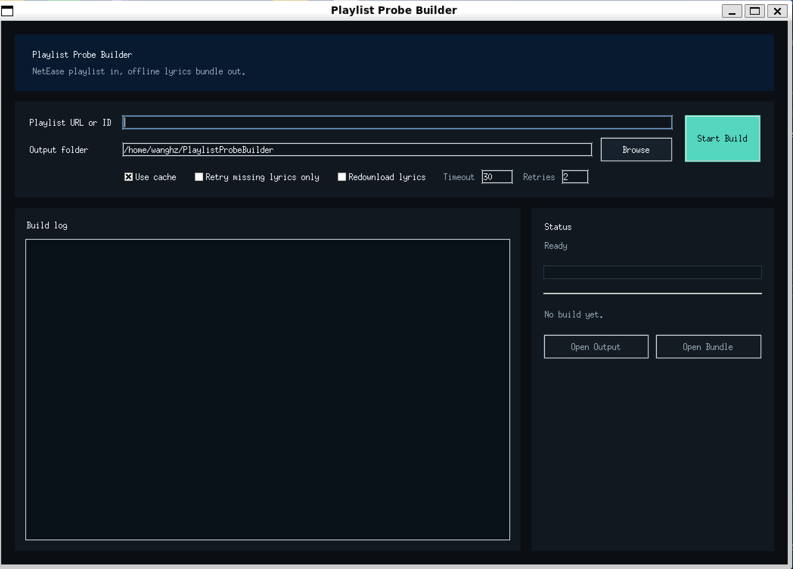
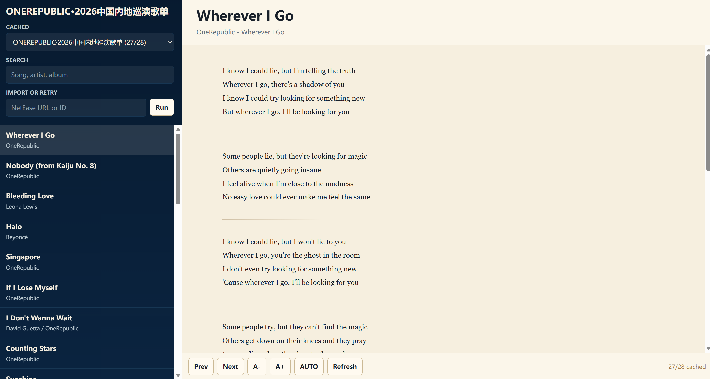
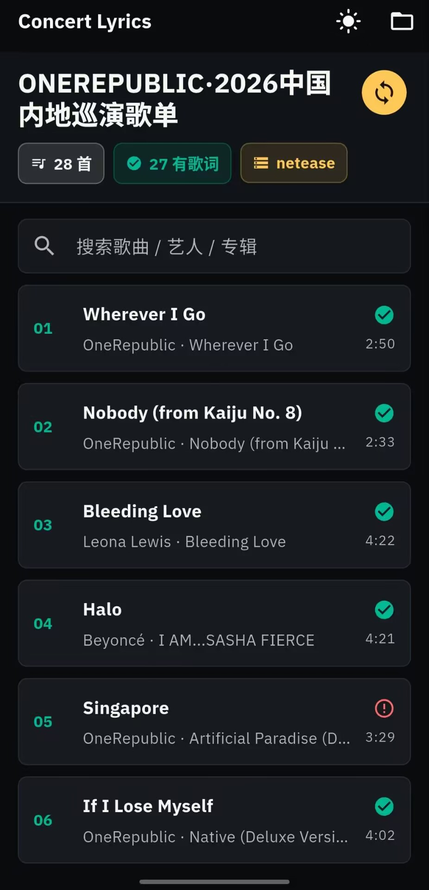

# Playlist Probe

将公开的网易云音乐歌单构建为可离线查看的歌词包。

## 项目简介

Playlist Probe 是一个用于抓取和整理歌单歌词的本地工具，目标是把公开歌单转换成适合本地浏览、离线查看的 `bundle.json` 数据包。

项目目前主要支持：

- 导入公开的网易云音乐歌单
- 抓取并整理歌词
- 生成本地可查看的离线歌词包
- 使用本地网页或桌面工具浏览已有缓存

---

## 歌单链接获取方式

在使用本工具前，请先在音乐 App 中获取歌单分享链接。

操作路径如下：

**网易云音乐 / QQ音乐 → 打开歌单 → 分享 → 复制链接**

然后把复制得到的歌单链接粘贴到本工具中即可。

> 注意：
>
> - 当前完整流程主要面向 **网易云音乐公开普通歌单**
> - **QQ音乐** 目前只有基础识别 / 占位支持，暂未接入完整抓取流程
> - 不是全部歌曲的歌词都能找到，主要是基于 LRCLIB 库（通常需要科学上网），抓取不到可能有网络问题
> - 如果你有更好的抓取方式可以联系我，并且重要的是生成bundle.json文件给到移动端，如果你已经有歌词的txt文件可以借助AI参考我给的实例json文件自己创建一个，这同样可以达到目的

---

## 桌面版构建器

面向普通用户的入口是 Windows 桌面版：

```bash
python app.py
````

桌面窗口支持以下功能：

* 粘贴网易云歌单链接或歌单 ID
* 选择输出目录
* 开始构建
* 查看进度与日志
* 打开生成的 `bundle.json`

开发或调试时，也可以使用命令行模式：

```bash
python app.py --url "https://music.163.com/playlist?id=17807176552" --output-dir "C:\PlaylistProbeBuild"
```

所选输出目录中会生成一个便于查找的文件：

```text
bundle.json
```

更详细的缓存与调试产物会写入以下目录：

```text
output/
webapp/
```

---

## 工作流程说明

整个流程采用 **缓存优先** 策略：

* 平时优先打开本地查看器，直接查看已经缓存好的歌词
* 只有在输入新的歌单链接或歌单 ID 时，才会执行导入
* 如果重复导入同一个歌单，程序会自动跳过已经缓存成功的歌曲，只重试缺失或失败的歌词

这意味着同一个歌单可以多次补全，而不需要每次都从头重新抓取。

---

## 运行环境 ！！！

项目通常在虚拟环境中使用，建议建立使用名为 `playlist_probe` 的 **conda 环境**。

```bash
conda create -n playlist_probe python=3.11
conda activate playlist_probe
pip install -r requirements.txt
python -m playwright install chromium
```

---

## 查看已有缓存

启动本地服务并查看已经缓存的歌单：

```bash
conda activate playlist_probe
python run_pipeline.py --serve
```

打开终端输出的本地地址后，页面会列出已经缓存的歌单。

这些歌单数据来自：

```text
webapp/data/playlists/<source>_<playlist_id>/bundle.json
```

最近一次选中的歌单也会复制到：

```text
webapp/data/bundle.json
```

---

## 导入或补全一个歌单

首先，请从音乐 App 中复制歌单链接：

**网易云音乐 / QQ音乐 → 歌单 → 分享 → 复制链接**

然后在本地页面中输入歌单链接或歌单 ID，点击 `Run`。

命令行等价方式如下：

```bash
python run_pipeline.py --url "https://music.163.com/playlist?id=17807176552"
```

或者：

```bash
python run_pipeline.py --playlist-id 17807176552
```

如果该歌单之前已经有部分歌词缓存，程序会保留已有结果，只抓取缺失或失败的部分。

---

## 仅重试缺失歌词

当之前因为网络不稳定导致 LRCLIB 抓取失败时，可以只重试缺失歌词：

```bash
python run_pipeline.py --playlist-id 17807176552 --retry-lyrics-only
```

可选调优参数示例：

```bash
python run_pipeline.py --playlist-id 17807176552 --retry-lyrics-only --lyrics-timeout 45 --lyrics-retries 4
```

如果需要强制重新下载全部歌词，可以使用：

```bash
python run_pipeline.py --playlist-id 17807176552 --force-lyrics
```

---

## 构建并立即预览

执行下面的命令后，程序会在构建完成后自动启动本地预览服务：

```bash
python run_pipeline.py --url "https://music.163.com/playlist?id=17807176552" --serve
```

如果默认端口被占用，服务会自动尝试后续端口。

---

## 输出目录结构

### 每个歌单的缓存目录

```text
output/playlists/netease_<playlist_id>/raw/
output/playlists/netease_<playlist_id>/meta/
output/playlists/netease_<playlist_id>/api_capture/
output/playlists/netease_<playlist_id>/normalized/
output/playlists/netease_<playlist_id>/enrich_debug/
output/playlists/netease_<playlist_id>/lyrics/
output/playlists/netease_<playlist_id>/app_bundle/
```

### 前端读取的数据目录

```text
webapp/data/index.json
webapp/data/bundle.json
webapp/data/playlists/netease_<playlist_id>/bundle.json
```

### 旧版目录

```text
output/lyrics/
output/normalized/
```

仍然会被识别；如果检测到当前歌单使用的是旧结构，程序会在首次复用时自动复制到新的按歌单分目录缓存结构中。

---

## 支持范围说明

当前一键流程主要聚焦于以下场景：

* 公开歌单
* 普通歌单
* 网易云音乐歌单

QQ音乐目前仍然只是占位支持，不属于完整主流程的一部分。

---

## 推荐使用方式

对于普通用户，推荐按照下面流程操作：

1. 在网易云音乐或 QQ 音乐中打开歌单
2. 点击“分享”
3. 点击“复制链接”
4. 打开本工具
5. 粘贴歌单链接
6. 选择输出目录
7. 开始构建
8. 构建完成后打开生成的 `bundle.json`

---

## 快速开始

如果你只是想尽快跑通一次完整流程，可以直接按下面操作：

```bash
conda activate playlist_probe
python app.py
```

然后在桌面窗口中：

* 粘贴歌单链接
* 选择输出目录
* 点击开始构建

或者使用命令行：

```bash
python app.py --url "https://music.163.com/playlist?id=17807176552" --output-dir "C:\PlaylistProbeBuild"
```

---

## 补充说明

本项目强调“缓存优先”和“重复利用已有结果”：

* 已经成功抓取过的歌词不会重复下载
* 网络不稳定时可以只补抓失败项
* 同一个歌单可以多次运行，逐步补全结果
* 已缓存数据可以直接在本地查看，不必反复抓取

这样更适合日常个人使用，也更方便后续把歌单离线整理为统一的本地数据包。

把下面这一段直接补进你原来的 `README.md` 里就行。比较合适的位置是放在 **“桌面版构建器”后面**，单独作为一个新章节。

````md
---

## 安卓端查看器

除了 Windows 桌面版之外，项目还提供了一个可安装到 **安卓手机** 的 APK 查看器 `concert_lyrics_app-test.apk`。

你可以先在电脑端完成歌单抓取与构建，得到对应的 `bundle.json`，再把这个文件导入到手机端进行查看。

手机端的使用方式如下：

1. 在安卓手机上安装提供的 APK
2. 将已经抓取完成的歌单 `bundle.json` 发送到手机
3. 打开手机端应用
4. 选择并一键导入 `bundle.json`
5. 导入完成后，即可在手机上离线查看歌单内容与歌词

适合的使用场景包括：

- 在电脑上完成歌单抓取与整理
- 在手机上随时查看已经整理好的歌词包
- 不需要重复抓取，只需要导入现成的 `bundle.json`

> 说明：
>
> - 当前手机端主要面向 **安卓设备**
> - 手机端用于 **导入和查看已生成的 `bundle.json`**
> - 推荐先在桌面端完成抓取，再将结果导入手机端使用

### 如何把 `bundle.json` 传到手机

你可以使用任意方便的方式把文件发送到安卓手机，例如：

- 数据线拷贝
- 微信 / QQ 文件传输
- Telegram
- 网盘
- 局域网传输工具

只要最终能在手机本地拿到 `bundle.json` 文件，即可导入。

### 手机端导入说明

桌面端构建完成后，常用的目标文件就是：

```text
bundle.json
````

将这个文件发送到手机后，在安卓应用中选择导入即可。

---

## 界面预览

### 桌面端截图 (python app.py)

> 在这里放桌面端截图



### 桌面端截图 (python run_pipeline.py --serve)



### 安卓端截图

> 在这里放安卓端截图



````
